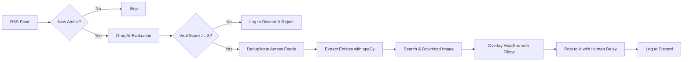

# Bird 🐦

> An automated bot that finds breaking news, scores viral potential with AI, generates headline images, and posts to X (Twitter).

---

```
[ RSS Feeds ] ──► [ Groq AI ] ──► [ spaCy NLP ] ──► [ Image Overlay ] ──► [ X (Twitter) ]
                         │                                                   │
                         ▼                                                   ▼
                  Discord Logs                                       Anti-Bot Delay
```

---

## How It Works

1. **RSS Ingestion**: Scans RSS feeds listed in `config/news-site.json`. Tracks the last run time in `config/time.txt` so it only processes new stories.
2. **AI Filtering & Rephrasing**: Sends articles to Groq (`meta-llama/llama-4-scout-17b-16e-instruct`):
   - Scores viral potential from 0 to 10 (accepts score $\ge 8$).
   - Rewrites headlines and summaries in a punchy, casual tone suitable for X.
   - Filters out duplicates across multiple feeds.
3. **Entity Extraction**: Uses `spaCy` to extract key people, places, and organizations from headlines for accurate image queries.
4. **Image & Text Overlay**:
   - Searches DuckDuckGo or Brave for matching images.
   - Masks sensitive/profane words.
   - Overlays the headline and emojis directly onto the image using Pillow and Pilmoji.
5. **Publishing to X**:
   - Uploads the image and posts the tweet via the X API.
   - Automatically splits text into replies if it exceeds character limits.
   - Uses randomized delays between actions to prevent bot detection and account suspension.
6. **Discord Notifications**: Sends real-time updates to dedicated Discord channels (accepted news, rejected news, duplicate removals, and error logs).

---

## Pipeline



---

## Setup & Configuration

### 1. Installation

```bash
git clone https://github.com/sauhardh/bird.git
cd bird
poetry install
```

### 2. Environment Variables

Create a `.env` file in the root directory:

```env
GROQ_API_KEY=your_groq_api_key

X_API_KEY=your_x_api_key
X_API_KEY_SECRET=your_x_api_key_secret
X_ACCESS_TOKEN=your_x_access_token
X_ACCESS_TOKEN_SECRET=your_x_access_token_secret
```

### 3. Configuration

- **RSS Sources**: Add or edit news feeds in [`config/news-site.json`](config/news-site.json).
- **Discord Webhooks**: Configure accept, reject, and info webhook URLs in [`config/constants.py`](config/constants.py).
- **Viral Keywords & Filters**: Adjust target keywords and censor lists in [`config/constants.py`](config/constants.py).

### 4. Run the Bot

```bash
poetry run python -m bot
```

---

## Bot Protection & Rate Limits

- **Human-like Delays**: Adds random wait times (40–60 seconds) between actions to stay off bot detection radars.
- **Rate Limit Handlers**: Catches Twitter `429 Too Many Requests` responses, waits for the reset window when short, or exits cleanly while pinging Discord.
- **Word Filtering**: Replaces sensitive or banned terms with asterisks before generating images to protect account health.


