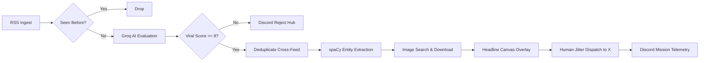

# 𝘉𝘐𝘙𝘋 🐦
> **The autonomous news hawk for X.**  
> *Sifting signal from the digital static, forging graphics on the fly, and dropping breaking dispatches before the world blinks.*

---

```
   RSS Feeds ──► [ Groq / Llama ] ──► [ spaCy Entity ] ──► [ Visual Forge ] ──► [ X / Twitter ]
        │              │                      │                   │                  │
        ▼              ▼                      ▼                   ▼                  ▼
    Wire Tap      Viral Radar            Who & What           The Canvas       Stealth Broadcast
        │
        └───────────────────────────────► Discord Telemetry 📡
```

---

## ✦ The Anatomy of the Flight

The internet never sleeps, but it constantly mumbles. **Bird** is a predator of noise—an automated newsroom engineered to spot friction, craft narrative, and broadcast at the speed of thought.

| Chamber | Role | What It Actually Does |
| :--- | :--- | :--- |
| **📡 The Wire Tap** | *Scout* | Glides through syndicated RSS feeds. A persistent internal clock ensures it never drinks from yesterday’s well twice. |
| **🧠 The Pulse Reader** | *Editor-in-Chief* | Feeds raw stories into **Groq-accelerated Llama**. Rates viral friction (0–10), tosses out dry whitepapers, strips duplicate echoes across rival publishers, and rewrites the headline with human pulse and casual bite. |
| **🎯 The Entity Hound** | *Investigator* | Dispatches **spaCy NLP** into the text to extract key protagonists, locations, and organizations. |
| **🎨 The Darkroom** | *Graphic Artist* | Hunts visuals across **DuckDuckGo** & **Brave**, then stamps bold, readable headline typography and emojis using **Pillow** & **Pilmoji**—complete with profanity dampeners. |
| **⚡ The Broadcaster** | *Courier* | Fires the dispatch onto **X** with randomized human jitter (40–60s pauses) and automatic thread-splitting to fly under automated radar. |
| **📡 Mission Control** | *Black Box* | Streams every accepted scoop, rejected pitch, and rate-limit warning directly into dedicated **Discord** telemetry channels. |

---

## ✦ Blueprint: How The Engine Thinks



---

## ✦ Quick Flight Setup

### 1. Fuel the Environment
```bash
# Clone the perch & enter
git clone https://github.com/sauhardh/bird.git
cd bird

# Equip dependencies
poetry install
```

### 2. Supply the Keys
Drop your operational credentials into a `.env` in the root:

```ini
# AI Brain
GROQ_API_KEY=gsk_...

# Broadcast Tower (X / Twitter API)
X_API_KEY=...
X_API_KEY_SECRET=...
X_ACCESS_TOKEN=...
X_ACCESS_TOKEN_SECRET=...
```

### 3. Tune the Radars
- **News Wires**: Add or cull RSS sources inside [`config/news-site.json`](config/news-site.json).
- **Mission Control**: Hook your Discord webhook feeds inside [`config/constants.py`](config/constants.py).
- **Viral Compass**: Adjust trending tokens and censorship masks in [`config/constants.py`](config/constants.py).

### 4. Release the Hawk
```bash
poetry run python -m bot
```

---

## ✦ The Survival Code *(Operating in the Wild)*

> [!WARNING]
> **X is hostile to automatons.**  
> Unchecked bots get clipped early. Bird is built with defensive mechanics:
> - **Synthetic Hesitation**: Injects organic random sleep intervals between uploads and replies.
> - **Self-Threading**: Gracefully chops run-on dispatches into threaded replies when characters overflow.
> - **Dynamic Rate-Limiting**: Catches `429 Too Many Requests`, honors `x-rate-limit-reset` timers, or aborts safely while paging Discord.
> - **Safe-Harbor Filtering**: Sanitizes high-risk triggers to keep your account out of algorithmic purgatory.

---

<p align="center">
  <i>Curated by algorithms. Styled like press. Moving faster than the cycle.</i>
</p>

